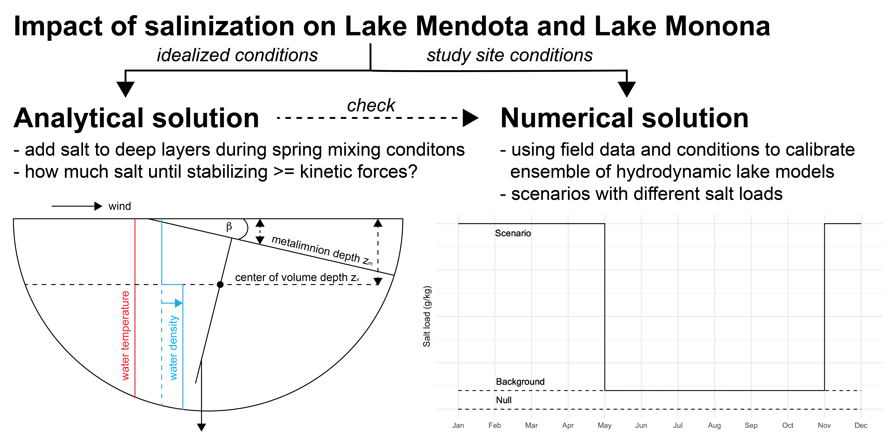

# salinization_lakestratification
Scripts, model configurations and outputs to process the data and recreate the figures from Ladwig, R., Dugan, H.A.: Impact of salinization on lake stratification.

This repository includes the setup and output from the lake model ensemble (GLM, GOTM, Simstrat) ran on the lakes Mendota and Monona. Scripts to run the models are located under /numerical and the scripts to process the results for the discussion of the paper are in the top main repository. The scripts to derive the theoretical solution are located under /analytical.

The figures are located under /figs.

<!-- -->
